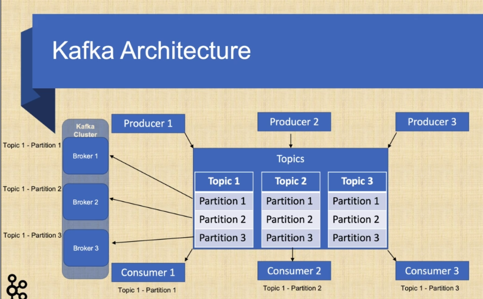

# 1. Introduction to microservice architecture

# 1.1. Intro to microservice architecture

- microservice: scalable service with independent development and deployment
- microservice patterns:

    - externalized configuration -> Spring Cloud Config
    - API versioning
    - service discovery -> Eureka
    - API gateway -> Spring Cloud Gateway
    - Circuit breaker -> Spring Cloud Gateway & Resilience4j
    - Rate limiting -> Spring Cloud Gateway & Redis
    - Event sourcing -> Kafka
    - CQRS - Kafka & PostgreSQL & ElasticSearch
    - Authn/z with Ouath 2.0 and OIDC -> keycloak authn/z server
    - Monitoring -> Spring Boot actuator, Prometheus, Micrometer & Grafana
    - Distributed tracing, log aggregation and visualization -> Spring Clodu Sleuth, Zipkin, Elasticsearch, Logstash &
      Kibana

- Kafka - brokers, topics, partitions, producer, consumer, Spring Kafka
- ElasticSearch - Index API, Query API, Spring Elastic data
- Containerization with Docker
- Reactive development

* Eventual consistency - A consistency model used in distributed computing to achieve high availability that informally
  guarantees that, if no new updates are made to a given data item, eventually al accesses to that item will return the
  last updated value

- Data stream - continogous flow of data incrementally processed
- Kafka streams - a lib to build streaming apps, input and output data stored in Kafka, compute aggregation or join
  streams
- Event-driven microservices - subscribe to events generated by other services on Event store
- Config server - externalized application configuration service
- API gateway - reverse proxy between client and backend services. Applies filters and routes to backend.
- Discovery service - register and find services; provides network location, IP and port
- Keycloak server - Identity and Access Managemet, Single Sign-on (SSO)
- Oauth2 & Open ID connect -
    - Oauth2: delegated authorization with access token
    - OpenID connect (OIDC): Authentication with ID token

- Event sourcing - time ordered sequence of state changes
- Event-driven architecture - Reliable & Fault-tolerant & Scalable services; services are truly decoupled,
  asynchronous & non-blocking
- Event - a change of state on the system that can be recognized, reacted and processed
- ACID transactions - Atomicity, Consistency, Isolation and Durability
- Kafka - it stores events in immutable format and provides fast, reliable and scalable way of applying event-driven
  architecture. It can be used for large amount of streaming data that requires scaling and high throughput, it scales
  up well by partitioning topics (the data structure that holds the data), which makes the horizontal scaling easier. (
  RabbitMQ is usally meant to be vertically scaled); Topic can be viewed as a folder in a filesystem (they hold the real
  data) and the event are the files within that folder.
- Kafka replication - replicates data on different partitions on different nodes for resiliency
- REST communication - Synchronous HTTP protocol and blocking calls (can be problematic regarding the load, service
  blocking, timeouts, services are strictly coupled)

# 2. Spring Boot

- starters:
    - spring-boot-starter-web: Spring core, embedded tomcat, Spring MVC, Jackson, Logback
    - spring-boot-starter-test: JUnit, Spring test, Mockito
    - spring-boot-starter-actuator: Healthcheck, monitoring and metric endpoints
    - spring-boot-starter-security: Spring security config, web security
    - spring-cloud-starter-config: Spring cloud common, context, config-client
    - spring-boot-starter-oauth2-resource-server: Spring security core, Oauth2, jose
    - spring-boot-starter-thymeleaf: Template engine
    - spring-boot-starter-data-jpa: JDBC, Hibernate, Spring data


- Eventual consistency - A consistency model used in distributed computing to achieve high availability
- that informally guarantees that, if no new updates are made to a given data item, eventually all accesses
  to that item will return the last updated value.


# 3. Kafka
- open-source stream processing platform, immutable, append-only logs
- designed to handle feeds with low latency and high throughput
- Kafka topic - structure that holds data/events; immutable & append-only; consists of one or more partitions which hold
the real data
- Characteristics:
  - fast  (relies on disk caching and memory mapped files instead of garbage collected eligible memory)
  - memory mapped file - contains the contents of a file in Virtual Memory; lower I/O latency than
  using a direct disk access; page cache (consists of physical pages in RAM, corresponds to physical
  blocks on DISK)
  - resilient (relies on the file system and disk, uses replicas)
  - scalable - scale by partitions; ordered inside partition (guaranteed per partition ) 
  - high throughput



Kafka producer - sends data to Kafka cluster; thread safe for multi-threading
- a partition can have only one consumer, a consumer can read multiple partitions 

The Producer has buffers of records per topic partition which are sized at **batch.size** property. 
The smaller the batch size the less the throughput and if the batch size is too big, the memory will be wasted since 
that part of memory is allocated for batching. This is because the data will be sent before the batch size limit hits.

Using a larger **batch.size** makes compression more efficient and if a data is larger than the batch size, it will not 
be batched.

Under heavy load, data will most probably be batched. However, under light load data may not be batched. In that case 
increasing **linger.ms** property can increase throughput by increasing batching with fewer requests and with an increased 
latency on producer send -> linger.ms is by default 0. If you define it, the request will wait for that period of time 
causing some delay.

The buffers are sent as fast as broker can keep up. And this can be limited by **max.in.flight.requests.per.connection**
property and if this sets to 1, any subsequent send request will wait the previous one return result.

By default, producer will wait all replicas to return result as the default value for acknowledge property is ack=all. 
By setting ack=1, only the broker that gets the request will send confirmation instead of waiting all in-sync replicas.

The producer property **compression.type** allows to set compression on producer level. Default value is none. This 
setting can set to none, gzip, snappy, or lz4. The compression is done by batch and improves with larger batch sizes.

End-to-end compression is also possible if the Kafka Broker config **compression.type** set to producer. Then the compressed
data will be sent from a producer, then goes to the topic and returned to any consumer in the compressed format. This 
way compression only happens once and is reused by the broker and consumer.

The Producer config property is **request.timeout.ms** default 30 seconds. It is a client property and causes the client
to wait that much time for the server to respond to a request

The Producer config property retries causes to retry a request if producer does not get an ack from kafka broker. It 
defaults to 0.

The Producer config property **partitioner.class** sets the partition strategy. By default, **partitioner.class** is set 
to org.apache.kafka.clients.producer.internals.DefaultPartitioner (distributes the load among brokers by applying Round-Robin
distribution algorithm)


- Key/Value Serializer Class
- compressionType 
- acks 
- batchSize 
- lingerMs 
- requestTimeoutMs
- retryCount

Apache Avro - data model specification; strict schema and efficient byte serialization


# External config repository
- one of the 12-factors

# sdkman

This lib will be installed under `~/.sdkman/candidates`
`sdk install springboot <version>`
`spring install org.springframework.cloud:spring-cloud-cli:2.2.3.RELEASE`

```
spring encrypt PLAIN_TEXT --key KEY
```

When use JCE, use `{cipher}ENCRYPTED_VALUE` (this `{cipher}` prefix is used to let Spring Boot know this value is encrypted
with JCE).