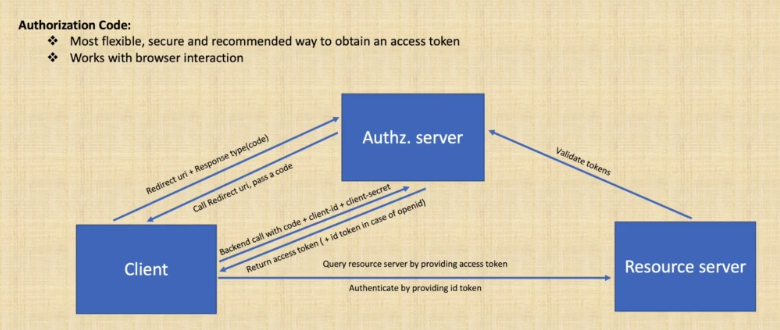

# 1. Introduction to microservice architecture

# 1.1. Intro to microservice architecture

- microservice: scalable service with independent development and deployment
- microservice patterns:

    - externalized configuration -> Spring Cloud Config
    - API versioning
    - service discovery -> Eureka
    - API gateway -> Spring Cloud Gateway
    - Circuit breaker -> Spring Cloud Gateway & Resilience4j
    - Rate limiting -> Spring Cloud Gateway & Redis
    - Event sourcing -> Kafka
    - CQRS - Kafka & PostgreSQL & ElasticSearch
    - Authn/z with Ouath 2.0 and OIDC -> keycloak authn/z server
    - Monitoring -> Spring Boot actuator, Prometheus, Micrometer & Grafana
    - Distributed tracing, log aggregation and visualization -> Spring Clodu Sleuth, Zipkin, Elasticsearch, Logstash &
      Kibana

- Kafka - brokers, topics, partitions, producer, consumer, Spring Kafka
- Elasticsearch - Index API, Query API, Spring Elastic data
- Containerization with Docker
- Reactive development

* Eventual consistency - A consistency model used in distributed computing to achieve high availability that informally
  guarantees that, if no new updates are made to a given data item, eventually al accesses to that item will return the
  last updated value

- Data stream - continuous flow of data incrementally processed
- Kafka streams - a lib to build streaming apps, input and output data stored in Kafka, compute aggregation or join
  streams
- Event-driven microservices - subscribe to events generated by other services on Event store
- Config server - externalized application configuration service
- API gateway - reverse proxy between client and backend services. Applies filters and routes to backend.
- Discovery service - register and find services; provides network location, IP and port
- Keycloak server - Identity and Access Management, Single Sign-on (SSO)
- Oauth2 & Open ID connect -
    - Oauth2: delegated authorization with access token
    - OpenID connect (OIDC): Authentication with ID token

- Event sourcing - time ordered sequence of state changes
- Event-driven architecture - Reliable & Fault-tolerant & Scalable services; services are truly decoupled,
  asynchronous & non-blocking
- Event - a change of state on the system that can be recognized, reacted and processed
- ACID transactions - Atomicity, Consistency, Isolation and Durability
- Kafka - it stores events in immutable format and provides fast, reliable and scalable way of applying event-driven
  architecture. It can be used for large amount of streaming data that requires scaling and high throughput, it scales
  up well by partitioning topics (the data structure that holds the data), which makes the horizontal scaling easier. (
  RabbitMQ is usually meant to be vertically scaled); Topic can be viewed as a folder in a filesystem (they hold the
  real
  data) and the event are the files within that folder.
- Kafka replication - replicates data on different partitions on different nodes for resiliency
- REST communication - Synchronous HTTP protocol and blocking calls (can be problematic regarding the load, service
  blocking, timeouts, services are strictly coupled)

# 2. Spring Boot

- starters:
    - spring-boot-starter-web: Spring core, embedded tomcat, Spring MVC, Jackson, Logback
    - spring-boot-starter-test: JUnit, Spring test, Mockito
    - spring-boot-starter-actuator: Healthcheck, monitoring and metric endpoints
    - spring-boot-starter-security: Spring security config, web security
    - spring-cloud-starter-config: Spring cloud common, context, config-client
    - spring-boot-starter-oauth2-resource-server: Spring security core, Oauth2, jose
    - spring-boot-starter-thymeleaf: Template engine
    - spring-boot-starter-data-jpa: JDBC, Hibernate, Spring data

- Eventual consistency - A consistency model used in distributed computing to achieve high availability
- that informally guarantees that, if no new updates are made to a given data item, eventually all accesses
  to that item will return the last updated value.

# 3. Kafka

- open-source stream processing platform, immutable, append-only logs
- designed to handle feeds with low latency and high throughput
- Kafka topic - structure that holds data/events; immutable & append-only; consists of one or more partitions which hold
  the real data
- Characteristics:
    - fast  (relies on disk caching and memory mapped files instead of garbage collected eligible memory)
    - memory mapped file - contains the contents of a file in Virtual Memory; lower I/O latency than
      using a direct disk access; page cache (consists of physical pages in RAM, corresponds to physical
      blocks on DISK)
    - resilient (relies on the file system and disk, uses replicas)
    - scalable - scale by partitions; ordered inside partition (guaranteed per partition )
    - high throughput
      

Kafka producer - sends data to Kafka cluster; thread safe for multi-threading

- a partition can have only one consumer, a consumer can read multiple partitions

The Producer has buffers of records per topic partition which are sized at **batch.size** property.
The smaller the batch size the less the throughput and if the batch size is too big, the memory will be wasted since
that part of memory is allocated for batching. This is because the data will be sent before the batch size limit hits.

Using a larger **batch.size** makes compression more efficient and if a data is larger than the batch size, it will not
be batched.

Under heavy load, data will most probably be batched. However, under light load data may not be batched. In that case
increasing **linger.ms** property can increase throughput by increasing batching with fewer requests and with an
increased
latency on producer send -> linger.ms is by default 0. If you define it, the request will wait for that period of time
causing some delay.

The buffers are sent as fast as broker can keep up. And this can be limited by **max.in.flight.requests.per.connection**
property and if this sets to 1, any subsequent send request will wait the previous one return result.

By default, producer will wait all replicas to return result as the default value for acknowledge property is ack=all.
By setting ack=1, only the broker that gets the request will send confirmation instead of waiting all in-sync replicas.

The producer property **compression.type** allows to set compression on producer level. Default value is none. This
setting can set to none, gzip, snappy, or lz4. The compression is done by batch and improves with larger batch sizes.

End-to-end compression is also possible if the Kafka Broker config **compression.type** set to producer. Then the
compressed
data will be sent from a producer, then goes to the topic and returned to any consumer in the compressed format. This
way compression only happens once and is reused by the broker and consumer.

The Producer config property is **request.timeout.ms** default 30 seconds. It is a client property and causes the client
to wait that much time for the server to respond to a request

The Producer config property retries causes to retry a request if producer does not get an ack from kafka broker. It
defaults to 0.

The Producer config property **partitioner.class** sets the partition strategy. By default, **partitioner.class** is set
to org.apache.kafka.clients.producer.internals.DefaultPartitioner (distributes the load among brokers by applying
Round-Robin
distribution algorithm)

- Key/Value Serializer Class
- compressionType
- acks
- batchSize
- lingerMs
- requestTimeoutMs
- retryCount

Apache Avro - data model specification; strict schema and efficient byte serialization

# External config repository

- one of the 12-factors

# JASYPT vs JCE

- JASYPT's default output is Base64 encoded (but can set output to HEX);
  on the other hand, JCE's output is by default in hexadecimal format.
- JASYPT doesn't support PBKDF2 - Password Based Key Derivation Function 2
- PBKDF2 uses salt and iteration count - reduces vulnerability to force brute force attacks (slow to compute in brute
  force manner) - the bigger iteration count, the harder to compute and with that, to apply brute force attack.
- Rainbow attacks - type of attack that uses a hash table to crack passwords by comparison
- JCE uses `AesBytesEncryptor` - based on PBKDF2 with salt and iteration count.
- Bear in mind that secrets are decrypted in config server and sent unencrypted to other services (so use TLS
  communication)

Asymmetric encryption:

- More secure - uses two keys
- Has a private secret key and a shared public key
- The message is encrypted with public key and can only be decrypted with private key
- slower than symmetric encryption because it has more complex logic
- provides confidentiality and data integrity (digital signature)
- example: RSA

Symmetric encryption:

- less secure - one key
- faster than asymmetric approach, as it uses the same key in encryption and decryption
- message is encrypted and decrypted with the same shared key
- provides confidentiality
- sharing the key securely is a challenge
- example: AES

# Kafka consumer

- Kafka relies on logs - partitions
- producer writes to the end of a specific partition (topic consists multiple partitions); consumers read the log
  starting from the beginning
- Kafka distributes partitions to consumers based on the consumer group id
- each partition is assigned to single consumer in a consumer group
- different consumer groups can read the same data from the same partition
- set partition number to be equal to consumer number. If you have more consumers than partitions, they will be idle.
- set poll timeout to a value not too big to prevent blocking indefinitely, not too small to prevent CPU being stalled
- to start from beginning with a new consumer group, we can set the `auto.offset.reset` to the earliest which the
  default
  value of latest which is the latest committed offset. You can assign method to set tracing offset explicitly. You can
  also
  use custom `ConsumerRebalanceListener` when subscribing and override `onPartitionAssigned` method and use
  `consumer.seekToBeginning` method.
- Partition strategy - hashing with key - `hash(key) % num_of_partitions`, Round-Robin
- Multithreading in a single consumer will not use parallel partition consuming. But, you can still use multiple threads
  in each consumer thread to gain some throughput which you can scale according to your need.
- Scaling per partition in consumer level is limited to partition number. We can add additional threads on each consumer
  but multiple threads will break ordering in single partition you need to take care of it. With multi thread
  consumer per partition of course we have more TCP connections to leader and brokers.
- Delivery semantics: At least once / At most once / Exactly once. Rely on consumer commits & acks.
    - If you commit after processing at least once, before processing at most once.
    - Exactly once requires to coordinate between producer and consumer and using transactions starting from producer
      part.

## Kafka consumer properties

Key/Value Deserializers
Consumer GroupId
Auto Offset Reset
Specific Avro Reader
Auto Startup
Concurrency Level
Session Timeout Ms
Heartbeat Interval Ms
Max Poll Interval Ms
Max Poll Records
Max Partition Fetch Bytes
Max Poll Duration Ms

# Elasticsearch

- open-source search engine
- Apache Lucene search engine - high performance full-featured text search engine
- Organize your data and make it easily accessible
- Easy RESTful API based on JSON
- Easy scale
- Type guessing, dynamic mapping and Lucene standard analyses
- Query DSL for complex queries

Inverted index:

- ES uses a structure called an inverted index, which is designed to allow very fast text searches
- Inverted index consists of a list of the unique words that appear in any document, and for each word, a list of the
  documents in which it appears
- you can find only terms that exist in your index, so both the indexed and query string must be normalized into the
  same form
- ES analyzers:
    - analyzing consists of 3 steps
        1. Character filters: tidy up the string like strip out HTML, change & to and etc.
        2. Tokenizers: tokenize the string into individual words and split the string into terms using
           whitespaces and punctuation
        3. Token filters: filter out the string like change the word like lowercase, remove terms like stop words such
           as __a__, __the__, and finally add words like synonyms.
    - ES provides many character filters, tokenizers and token filters out of the box. These can be combined to create
      custom analyzers suitable for different purposes

- Basic data types:
    - Binary: Base64 encoded string
    - Numbers: integer, long, double
    - Boolean: true/false
    - Text: Analyzed, unstructured text
    - Keywords: keywords, wildcards (not analyzed)
    - Object: A JSON object
    - Date:
        - A formatted date as string
        - An integer that represents seconds since the epoch
        - A long that represent milliseconds since the epoch

- prevent split brain - maximize number of nodes which could be down at the moment

`master_eligible_nodes / 2 + 1` - quorum formula

# HATEOAS

HATEOAS - Hypermedia As The Engine Of Application State
Richardson maturity model: 
-****- Hypermedia controls  
-***- Multiple URI & HTTP Verbs  
-**- Resources with multiple URI & Single Verb  
-*- Single URI & Single Verb  

- the representation for REST resources should contain links to related resources, not only the data itself

# API versioning

- changes in API are inevitable
- using semver -> major.minor.patch
    - major - breaking changes
    - minor - new features, non-breaking changes
    - patch - bugfixes, security patches
- take care about backward compatibility & forward compatibility
  Backward compatibility:
    - Client ---> Server (uses)
    - Updated client ---> Updated server (uses)
    - Updated client ---> Server (can use) 
      Demands a new version.

  Forward compatibility:
    - Client ---> Server (uses)
    - Updated client ---> Updated server (uses)
    - Client ---> Server (can use)
      How to achieve forward compatibility: extended schemas and documentation. If we are not forward compatible, we
      have a breaking change (new major release).

Versioning options:

1) URI versioning - version in the URI

- leads to larger URI footprint; difficult to maintain and less flexible. Against ste hypermedia-driven RESTful APIs
  which states that the initial URI should not be changed and be the only information given to client along with the
  media
  types where rest will be resolved by hypertext returned to client.
- Does not belong to contract
- On the other hand it is easy to be used by client as using other options require more programatic approach.
- it is cache-friendly as caching with URL is easy, while the caching via header requires more work.

Example: 
http://localhost/v1/documents 
http://localhost/v2/documents 

2) Media type versioning (Content negotiation) - version in the representation using accept header and custom header and
   custom vendor media type:

- requires more work to implement especially at the client side and more difficult to use with caching
- it is part of the contract
- custom vendor type brings more semantic information
- on the other hand, it is flexible to version part of API and works well with HATEOAS and Level 3 REST APIs according
  to Richardson Maturity model.

https://martinfowler.com/articles/richardsonMaturityModel.html

Example: 
Accept: application/vnd.api.v1+json 
Accept: application/vnd.api.v2+json 

3) Custom HTTP headers - version with custom header

- less standard and requires more alignment with client
- similar to accept header, it is more flexible and can align with Level 3 REST APIs
  Example: 
  My-custom-header: v1 
  My-custom-header: v2 

4) Query parameters - version with query parameter

- difficult to use with routing
- easy to use

Example: 
http://localhost/documents?version=1  
http://localhost/documents?version=2  

# Open API docs
- Spring docs = Open API specification + Spring Boot
- Single dependency: springdoc-openapi-ui
- Based on Swagger3
- Automate the generation of API documentation (`@Operation`, `@ApiResponse`)
- JSON, YAML and HTML formats
- Supports content negotiation versioning

# Web clients

- Spring WebClient: async and non-blocking successor of RestTemplate
- Thymeleaf: Server-side Java template engine, well integrated with Spring
- HTML Thymeleaf templates with Bootstrap - HTML, CSS and JS
- Client-side load balancing with Spring Cloud @LoadBalancer 

# Oauth 2.0 and OpenID Connect Protocols
- Oauth 2.0: For delegated authorization by using an access token
- OpenID Connect: For authentication of user by using an ID token
- Oauth 2.0 terminology:
  - Resource owner: User that owns the resource. This user will provide the user/pwd 
  as initial authentication to get an access token
  - Client: Site that holds a functionality that will require a user to authenticate/authorize first
  - Authorization server: Server that holds the user credentials and is used to authenticate and authorize user and 
  return access token and ID token
  - Resource server: Site that returns the resource to the client when client provides the correct tokens obtained from
  authz server.
  - Authorization grant: Rights granted during oauth
  - Redirect URL: Callback URL on client site
  - Response type: Code or token
  - Access token: token to use in authorization to reach to resource server
  - OpenID token: Token that includes user details and is used to log in to a system

## Oauth2 flows

- Authorization code:
  - client redirects the call to authz server with a request that includes redirect URL and
  response type as code, can also include scopes like read/write to limit the rights granted, to be 
  checked at resource server
  - user is asked that X client wants to access your Y privilege. If user confirms, enter credentials
  - If credentials are correct, user is redirected to redirect URL on client by passing a code
  - Client then make a backend call to authz server with the code + client-id + client-secret where client-id and 
  client-secret were obtained during registration of the client to authz server previously
  - Then authz server returns an access token

- Implicit:
  - Client redirects the call to authz server with a request that includes redirect URL and response type as token, can 
  also include scope for like read/write to limit the rights granted to be checked at resource server
  - User is asked that X client wants to access your Y privilege. If user confirms, enter credentials.
  - If credentials are correct, user is redirected to redirect URL on client by passing a code
  - No backend call as in Authorization code flow. So implicit flow is considered as less secure. Be careful with 
  client-side attacks like XSS

- Resource owner password credentials:
  - Client sends resource owner's user/pwd to authz server with a backend call
  - considered to be less secure as resource owner's credentials shared with client avoid using this

- Client credentials:
  - No user included, machine to machine communication with a backend call by sending the client-id/client-secret

## OpenID connect
- Brings standard for authentication in Oauth as there is no standard way of getting user information in Oauth protocol
- Additional protocol on top of Oauth where Oauth is designed for authorization with permissions and scopes
- OpenID connect adds ID token and user info endpoint and brings standard set of scopes for authentication to standardize
implementation
- Use the same flow with Oauth, add scope:openid. So, in the authz code flow, by adding scope:openid, authz server will
  return both ID token and access token
- Use for logging the user in and making an account available for other systems (SSO). While Oauth is for granting 
access to an API and getting access to user data in other systems.
- Can be used easily with microservices. First service gets openid and access token and provides it to another service
for auhtn/authz purposes.
- Can be used by web application with a normal flow and creating a session on browser and placing tokens in headers

## JWT
- de-facto standard token format
- three-part format: header.{claims or payload}.signature
- signed by server's private key, optionally encrypted with public key (client can send
public key along with redirect URL)
- In transit, Base64-encoded JWT is used.

## Validation of token
Resource server:
- JWT includes a signature. Resource server validates integrity of JWT by looking at alg claim and fetching public
key from jwks URL to check the signature. JWKS (JSON web key store) URL provides keys. Resource server can figure out 
the JWKS by looking at iss on JWT.
- Check if iss(issuer) claim has a valid URL definition where iss identifies the issuer that issued JWT.
- Validate exp claim to identify if JWT is expired. If expired a new token request or refresh token request required.
- Validate timestamp by looking at iat claim on JWT where iat is the issued at timestamp indicating the age of JWT.
- Optional check for aud (audience) claim to identify the intended recipient of the token in case of oauth. On the other
hand for OpenID, aud claim refers to the client_id that request the resource. Note that Audience is mandatory for ID 
tokens.
- Optional check for nonce claim. Nonce used to associate a client session with an id token and in case of OIDC it 
should be used to prevent replay attacks by including a cryptographically secure random string in id token as well as in 
the authn request and then required a check for both value on the server to validate client before authentication. Nonce
should be re-created in each request.
- Check the scopes and roles by parsing JWT to enable authorization

Client:
- Validates integrity of ID token by checking the signature as resource server checks access token
- Check if iss (issuer) claim has a valid URL definition where iss identifies the issuer that issued JWT.
- Validates exp claim to identify JWT is expired. If expired a new token request or refresh token required. 

# Kafka streams
- A library for building streaming applications, where input and output data are stored in Kafka clusters
- Transform input Kafka topics into output Kafka topics
- Additional layer on top of Kafka producer/consumer APIs
- Designed to use simple Java/Scala apps along with Kafka server-side technologies
- Works well when we want to compute aggregations or join streams of data

Basic flow:
  - Create a StreamBuilder
  - Define input KStream by using StreamBuilder, input serde type and input Kafka topic
  - Create computational logic that is called Topology like map/flatMap values, use group by etc
  - Send the data to output topic with output KStream by using output serde type

- Serde types are used to define serialization/deserialization objects in stream processing
- Can also be used with state store. During streaming, a materialized read-only key store can
be used to store computed result which can then be queried, for example with a REST API.